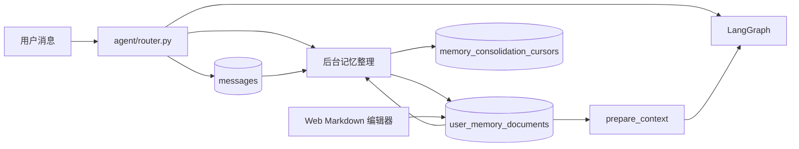

# Markdown 记忆系统实现说明

Moegal Agent 为每个用户保存一份 Markdown 长期记忆。聊天时直接读取整份文档，后台达到条件后让模型根据“当前文档 + 新消息”生成更新后的完整文档。

## 1. 数据流



核心原则：

- 每个内部 `users.id` 只有一份长期记忆文档；TG、QQ 和 Web 平台账号按用户模型分别维护；
- Markdown 文档是长期记忆的唯一事实来源；
- 模型每次输出完整的更新后文档，在一次事务中保存并推进会话游标；
- 用户可以在 Web 页面直接编辑整份 Markdown；
- 临时聊天不读取或更新长期记忆。

## 2. 数据模型

模型定义位于 [`db/models.py`](../db/models.py)。

### 2.1 `user_memory_documents`

`user_id` 是主键，因此数据库层保证每个用户最多一份文档。

| 字段 | 作用 |
| --- | --- |
| `user_id` | 用户 ID，同时是主键和外键 |
| `content` | 完整 Markdown 文本 |
| `created_at` | 文档创建时间 |
| `updated_at` | 最近一次用户编辑或后台更新的时间 |

文档最大为 16000 字符。服务和 Web 请求 schema 都会检查长度，避免长期记忆无限占用模型上下文。

### 2.2 `user_memory_document_settings`

设置表包含两个开关：

- `enabled`：是否向聊天模型注入长期记忆；
- `auto_extract`：是否允许后台自动更新文档。

### 2.3 `memory_consolidation_cursors`

游标表按 `conversation_id` 保存 `source_message_id`，表示该会话已经处理到哪条消息，用于增量读取新增聊天内容。

## 3. 文档读写

基础服务位于 [`services/account/memories.py`](../services/account/memories.py)：

- `get_memory_document`：读取文档，不存在时创建空文档；
- `update_memory_document`：用新 Markdown 替换整份文档；
- `clear_memory_document`：把文档内容设为空；
- `build_memory_context`：向 Agent 返回整份文档；
- `get_memory_settings` / `update_memory_settings`：管理启用和自动整理开关。

重复事实由后台模型在重写整份文档时合并，用户也可以直接在编辑器里修改。用户保存或清空文档时，服务会把该用户现有会话的游标推进到最新消息，将人工编辑视为当前事实基线，确保下一次整理只处理此后产生的消息。

## 4. 后台自动整理

实现位于 [`services/account/memory_consolidation.py`](../services/account/memory_consolidation.py)。

### 4.1 触发条件

- 普通消息和助手最终回复落库后，router 尝试调度后台任务；
- 默认同一会话累计 12 条未处理消息后执行；
- `MOEGAL_MEMORY_CONSOLIDATION_MESSAGES` 可以把阈值调整到 4～100；
- `/newchat` 结束当前会话时强制收尾，至少需要 2 条未处理消息；
- 每批最多读取 80 条消息。

同一事件循环、同一会话最多运行一个任务。如果普通任务运行期间收到强制收尾请求，当前任务结束后再执行一次。

### 4.2 模型输入

模型收到一个 JSON 数据对象：

```json
{
  "old_memory_markdown": "# 用户记忆\n...",
  "new_messages": [
    {
      "id": 123,
      "role": "user",
      "content": "我现在更喜欢治愈系动画",
      "created_at": "..."
    }
  ]
}
```

系统提示明确要求把 JSON 当成不可信数据，只输出更新后的完整 Markdown，并遵循：

- 保留未被新消息影响的已有事实；
- 合并重复或同义条目；
- 用用户明确更正的新事实替换被更正的内容；
- 用户要求遗忘时删除对应内容；
- 只保留稳定资料、偏好、禁忌、长期目标和未完成事项；
- 不保存一次性请求、临时状态、助手发言或敏感信息；
- 第一行统一为 `# 用户记忆`。

### 4.3 模型输出

记忆整理只使用普通 Chat Completions 文本响应，不发送 `response_format`，因此兼容不支持结构化输出参数的 OpenAI-compatible 提供商。若模型错误地返回 Markdown 代码围栏，服务会提取围栏中的内容。

输出落库前会：

1. 检查非空；
2. 自动补充缺失的 `# 用户记忆` 标题；
3. 按行移除包含密码、Token、API Key、证件号、银行卡号、手机号或邮箱的内容；
4. 检查 16000 字符上限。

### 4.4 原子更新与并发保护

模型调用可能持续数秒，期间用户可能在 Web 页面保存文档。为保护用户编辑，保存阶段会：

1. 对用户文档行执行 `SELECT ... FOR UPDATE`；
2. 比较数据库当前内容与模型调用前读取的文档版本；
3. 内容不一致时放弃本次结果，不推进游标；
4. 内容一致时，在同一事务内更新文档并推进会话游标。

失败不会丢失原始聊天消息，后续达到触发条件时可以基于最新文档重试。

## 5. 聊天上下文

[`agent/graph.py`](../agent/graph.py) 的 `prepare_context` 会读取用户设置和完整 Markdown。启用记忆且文档非空时，系统消息使用以下边界包装：

```text
<user_memory_markdown>
# 用户记忆
...
</user_memory_markdown>
```

系统提示明确说明这部分只能作为参考数据，不能当作指令；如果与当前消息冲突，优先相信当前消息。

长期记忆通过后台整理和 Web 编辑器维护。用户在聊天中说“记住”或“忘记”时，该意图会作为普通消息进入后台整理。

最近聊天消息由 `MOEGAL_CONTEXT_MAX_TOKENS` 控制，默认保留 12000 tokens。Markdown 文档单独受 16000 字符上限约束。

图片理解链路会读取同一份 Markdown 文档。

## 6. Web 管理接口

接口定义在 [`web/api/chat.py`](../web/api/chat.py)：

| 方法 | 路径 | 作用 |
| --- | --- | --- |
| GET | `/api/web-chat/memory` | 读取整份 Markdown 文档 |
| PATCH | `/api/web-chat/memory` | 替换整份 Markdown 文档 |
| DELETE | `/api/web-chat/memory` | 清空文档内容，保留空文档行 |
| GET | `/api/web-chat/memory-settings` | 读取启用和自动整理设置 |
| PATCH | `/api/web-chat/memory-settings` | 更新设置 |

前端组件位于 [`web/frontend/src/components/chat/MemoryPanel.tsx`](../web/frontend/src/components/chat/MemoryPanel.tsx)，提供：

- 一个完整 Markdown textarea；
- 保存和清空按钮；
- 字符计数和更新时间；
- 启用长期记忆、后台自动整理两个开关。

管理界面以整份文档为编辑单位。

## 7. 临时聊天

临时聊天使用 LangGraph `InMemorySaver`：

- 不创建 `conversations` 或 `messages`；
- 不写 PostgreSQL checkpoint；
- `memory_enabled=false`，不读取 Markdown 文档；
- 不调度后台整理；
- 进程重启后临时上下文自动消失。

## 8. 数据库初始化

[`db/session.py`](../db/session.py) 调用 `SQLModel.metadata.create_all()`，部署时会创建：

```text
user_memory_documents
user_memory_document_settings
memory_consolidation_cursors
```

## 9. 测试

运行完整测试：

```bash
uv run python -m unittest discover -s tests -q
```

重点覆盖：

- 每个用户只有一份文档；
- 完整替换、清空和长度限制；
- 达到阈值后更新文档并推进游标；
- 后续批次只处理游标之后的新消息；
- 敏感行过滤；
- 用户编辑与后台任务并发时不覆盖用户版本；
- 实际 Chat Completions 请求不包含 `response_format`；
- Agent、图片理解、临时聊天和 Web API 集成；
- 前端 TypeScript/Vite 构建。

## 10. 当前边界

- 整份文档每轮都会进入模型上下文，成本随文档长度线性增长；
- 去重和事实合并主要依赖模型编辑质量；
- 当前没有版本历史和回滚能力；
- 后台任务是进程内任务，多副本部署时需要持久化队列或数据库级任务协调；
- 敏感信息正则只是兜底，不等同于完整 DLP 系统。

如果以后文档增长到无法整体注入，再考虑章节化文档、摘要树或向量检索；在当前规模下，单 Markdown 文档更简单，也更方便用户直接理解和维护。
