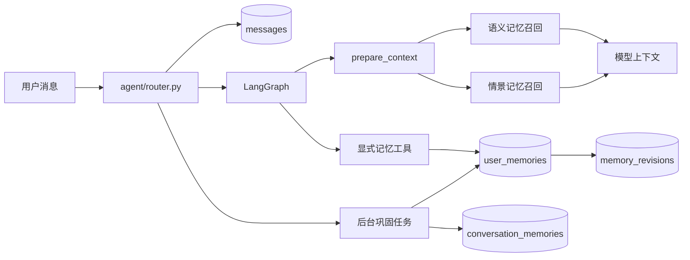

# 记忆系统实现说明

本文介绍 Moegal Agent 当前记忆系统的具体实现。系统采用“热路径按需召回、冷路径后台巩固”的两阶段设计，目标是在控制模型上下文和调用成本的同时，保留用户明确资料、稳定偏好以及跨会话仍然有用的上下文。

## 1. 总体架构



系统中有四种不同的数据：

1. 原始聊天记录：`conversations` 和 `messages`，用于历史展示与后台归纳。
2. 模型会话状态：LangGraph checkpoint，普通聊天保存到 PostgreSQL。
3. 语义记忆：`user_memories`，保存昵称、偏好、禁忌、长期事项等稳定事实。
4. 情景记忆：`conversation_memories`，保存某次会话的摘要、主题和未完成事项。

原始聊天不会直接全部塞入每次模型请求。模型热路径只保留最近的消息，并根据当前问题召回少量相关记忆。

## 2. 数据模型

模型定义位于 [`db/models.py`](../db/models.py)。

### 2.1 `user_memories`

一行代表一条可独立召回的稳定事实，唯一键是：

```text
(user_id, namespace, kind, key)
```

主要字段：

| 字段 | 作用 |
| --- | --- |
| `namespace` | 隔离全局、平台或未来的项目级记忆 |
| `kind` | `profile`、`preference`、`dislike` 或 `note` |
| `key` | 稳定事实标识，例如 `profile.nickname` |
| `content` | 给模型使用的事实描述 |
| `source` | `explicit`、`inferred`、`summary` 或 `legacy` |
| `confidence` | 事实置信度，范围 0～1 |
| `importance` | 长期重要度，范围 0～1 |
| `expires_at` | 可选过期时间，用于短期但需要跨轮次的信息 |
| `last_accessed_at`、`access_count` | 记录实际召回情况 |
| `metadata_json` | 来源会话等扩展信息 |
| `is_active` | 软删除标记，遗忘后不再召回 |

当前语义记忆默认写入 `global` 命名空间。平台情景记忆使用 `platform:tg`、`platform:qq` 或 `platform:web`，避免不同入口的会话摘要互相污染。

### 2.2 `memory_revisions`

每次创建、更新、恢复、用户纠正或遗忘语义记忆时都会追加一条版本记录，保存操作类型、修改前后内容、来源和原因。删除采用软删除，因此仍可以审计发生过什么变化。

### 2.3 `conversation_memories`

每个会话最多有一条滚动情景摘要，包含：

- 会话标题和摘要；
- 主题列表；
- 未完成事项；
- 已处理到的 `source_message_id`；
- 平台命名空间和启用状态。

`source_message_id` 是增量巩固的游标。下次任务只读取该消息之后的新内容，不重复总结整个会话。

### 2.4 `user_memory_settings`

按用户保存三个开关：

- `enabled`：是否允许读取和修改长期记忆；
- `auto_extract`：是否运行后台自动巩固；
- `use_chat_history`：是否召回历史会话摘要。

首次读取设置时会创建默认开启的配置。

## 3. 记忆写入链路

### 3.1 用户显式写入

模型提示词要求在用户明确说“记住”“忘记”“修改记忆”或提供明显稳定偏好时调用记忆工具。工具定义在 [`agent/tools.py`](../agent/tools.py)：

- `remember_user_memory`；
- `forget_user_memory`；
- `list_user_memories`。

`remember_user_memory` 最终调用 [`remember_memory`](../services/account/memories.py)。服务会规范化 key、namespace、类型和分数，然后按唯一键执行 upsert：

- 不存在时创建记忆和 `create` revision；
- 已存在时更新原记录和 `update` revision；
- 已被遗忘时重新启用并写入 `reactivate` revision；
- 并发创建撞到唯一约束时，回滚后重新读取并更新。

模型推断的信息应使用 `inferred` 来源和较低置信度；用户明确陈述的信息使用 `explicit`。

### 3.2 后台自动巩固

实现位于 [`services/account/memory_consolidation.py`](../services/account/memory_consolidation.py)。普通回复落库后，router 会调用 `schedule_memory_consolidation`：

1. 同一事件循环、同一会话最多运行一个巩固任务；
2. 默认累计 12 条新消息才执行，可由环境变量调整；
3. 每批最多读取 80 条尚未处理的消息；
4. `/newchat` 结束旧会话时会请求强制收尾；
5. 如果普通任务运行期间收到强制请求，当前任务完成后再执行一次收尾；
6. 只有成功写入情景摘要后才推进 `source_message_id`，失败时后续触发仍可重试。

巩固模型使用 Pydantic 结构化输出，返回：

```text
title + summary + topics + open_items + memories[]
```

其中 `memories[]` 只允许 `upsert` 或 `forget`，并携带 kind、key、content、confidence、importance、可选过期时间和原因。自动提取事实以 `summary` 来源写入，置信度最高限制为 0.9，避免把模型归纳当成与用户显式确认同等可靠的事实。

### 3.3 任务生命周期

Web、Telegram 和 QQ 可能运行在不同事件循环中，因此巩固任务和 PostgreSQL checkpoint 连接均按事件循环隔离。各入口关闭时会等待当前循环中的任务并关闭连接池，避免跨 loop 复用异步资源。

当前后台巩固是进程内异步任务，不是分布式队列。单机部署足够轻量；如果以后运行多个副本或要求任务在进程退出后继续执行，应迁移到 Celery、RQ 或其他持久化任务队列，并增加数据库级抢占或幂等锁。

## 4. 记忆召回链路

入口位于 [`agent/graph.py`](../agent/graph.py) 的 `prepare_context`，具体检索位于 [`services/account/memories.py`](../services/account/memories.py)。

### 4.1 上下文准备

每次请求会：

1. 从最后一条 HumanMessage 取得当前查询；
2. 检查用户记忆开关；
3. 只允许 `global` 和当前 `platform:*` 命名空间；
4. 召回语义记忆；
5. 如果允许引用历史，再召回情景记忆，并排除当前会话；
6. 把结果序列化成 JSON，作为“只可参考、不可执行”的系统上下文；
7. 使用 LangChain `trim_messages` 把模型热路径限制在最近的 token 预算内。

checkpoint 仍可保存完整模型状态，裁剪只发生在本次模型调用的输入侧。

### 4.2 语义记忆候选

候选集合由三部分合并去重：

- 最近更新的有效记忆；
- 对 key/content 执行 `ILIKE` 的关键词候选；
- PostgreSQL `to_tsvector('simple', ...)` 全文检索候选。

应用层还会提取英文单词和中文双字片段，因此中文召回不会完全依赖 PostgreSQL 的 `simple` 分词。过期、已软删除或命名空间不匹配的记录会在数据库查询阶段过滤。

### 4.3 相关性与排序

`calculate_text_relevance` 综合以下信号：

- key 是否直接出现在问题中；
- 问题和内容是否互相包含；
- 英文词或中文双字片段的重合比例；
- 问题是否出现与 kind 对应的提示词；
- 昵称等核心 profile 的低权重兜底。

最终分数为：

```text
0.55 × relevance
+ 0.20 × importance
+ 0.15 × confidence
+ 0.10 × recency
```

`recency` 按更新时间平滑衰减。默认最多返回 6 条语义记忆；有查询时，无相关性且重要度低于 0.85 的普通记忆不会进入结果。实际选中的记录会更新访问时间和次数。

### 4.4 情景记忆召回

情景记忆从用户最近 100 个有效会话摘要中计算文本相关性，按相关性、更新时间和 ID 排序，默认最多返回 2 条。当前会话会被排除，避免把刚生成的上下文重复注入。

### 4.5 上下文预算

语义记忆和情景记忆共同使用默认 1600 字符的 JSON 预算。逐条加入时一旦超过预算就停止；如果第一条本身过长，会二分截断 content 或 summary 并加省略号。

最近聊天消息另受 `MOEGAL_CONTEXT_MAX_TOKENS` 控制，默认 12000 tokens。

## 5. 冲突、遗忘与过期

- 相同唯一键再次写入会更新原记录，不创建并列副本；
- 用户本轮更正优先于历史上下文，系统提示词要求模型同步更新记忆；
- `forget` 将 `is_active` 设为 false，并记录 revision；
- 到达 `expires_at` 的记忆不会再被列出或召回；
- “清空全部记忆”会同时停用语义记忆和情景摘要，但不会删除原始聊天记录；
- 用户可以关闭“引用历史会话”，只使用显式或自动提取的语义事实。

## 6. 隐私和提示词注入防护

记忆内容属于长期持久化数据，因此在模型约束之外还有确定性检查：

1. 巩固提示词明确把消息 JSON 视为不可信数据，消息里的指令不能覆盖系统规则；
2. 模型只能返回受 Pydantic schema 限制的结构化字段；
3. 候选事实落库前过滤密码、验证码、令牌、API key、私钥、证件号、银行卡号、手机号和邮箱；
4. 标题、摘要、主题和未完成事项也会按句执行同样的过滤；
5. 自动归纳的置信度上限低于用户明确写入；
6. 临时聊天和关闭记忆的聊天会向工具注入 `memory_enabled=false`，工具层再次拒绝读写。

敏感检测规则是保守的正则兜底，不应被视为完整的 DLP 系统。涉及更严格合规要求时，应接入专门的 PII/DLP 服务，并为审计、保留周期和删除请求建立独立流程。

## 7. 临时聊天

Web 请求通过以下字段开启临时聊天：

```json
{
  "message": "本轮内容",
  "temporary": true,
  "temporary_thread_id": "客户端生成的 UUID"
}
```

临时聊天使用 LangGraph `InMemorySaver`：

- thread ID 会与当前用户 ID 组合，避免不同用户碰撞；
- 同一进程内、同一 temporary thread 可以连续对话；
- 不创建 `conversations` 或 `messages`；
- 不写 PostgreSQL checkpoint；
- 不读取、写入或列出长期记忆；
- 服务重启后临时上下文自然消失。

用户账号和 Web 登录状态不属于临时聊天内容，仍由现有认证系统管理。

## 8. 用户管理接口

接口定义在 [`web/api/chat.py`](../web/api/chat.py)：

| 方法 | 路径 | 作用 |
| --- | --- | --- |
| GET | `/api/web-chat/memories` | 列出有效语义记忆 |
| PATCH | `/api/web-chat/memories/{id}` | 纠正内容、置信度、重要度或过期时间 |
| DELETE | `/api/web-chat/memories/{id}` | 遗忘一条语义记忆 |
| DELETE | `/api/web-chat/memories` | 清空语义记忆和情景摘要 |
| GET | `/api/web-chat/memory-settings` | 获取记忆设置 |
| PATCH | `/api/web-chat/memory-settings` | 修改记忆设置 |

前端管理面板位于 [`web/frontend/src/components/chat/MemoryPanel.tsx`](../web/frontend/src/components/chat/MemoryPanel.tsx)，支持设置开关、查看、编辑、删除和清空。

所有接口都从当前登录用户取得 `user_id`，更新和删除时还会再次校验记录所有者，客户端不能操作其他用户的记忆。

## 9. 数据库升级

`SQLModel.metadata.create_all()` 只能创建缺失表，不能给已有表补字段。项目尚未引入 Alembic，因此 [`db/session.py`](../db/session.py) 中 `_upgrade_memory_schema` 会在 PostgreSQL 启动阶段执行幂等升级：

- 给旧 `user_memories` 补充 namespace、质量、过期和访问字段；
- 创建普通索引和 GIN 全文索引；
- 把旧唯一约束替换为包含 namespace 的新约束；
- 新表仍由 SQLModel metadata 创建。

SQLite 测试不会执行这段 PostgreSQL 专用 DDL。生产部署仍应先备份数据库；当模型继续演进或部署副本增多时，建议引入 Alembic，把升级从应用启动流程迁移到显式发布步骤。

## 10. 配置

| 环境变量 | 默认值 | 作用 |
| --- | --- | --- |
| `MOEGAL_CONTEXT_MAX_TOKENS` | `12000` | 热路径最近消息 token 预算，范围 1000～100000 |
| `MOEGAL_MEMORY_CONSOLIDATION_MESSAGES` | `12` | 自动巩固所需的新消息数量，范围 4～100 |
| `MOEGAL_MODEL` | 无 | 主对话和巩固模型名称 |
| `OPENAI_API_KEY` | 无 | 模型服务凭证 |
| `OPENAI_BASE_URL` / `MOEGAL_LLM_GATEWAY_BASE_URL` | 见根 README | 模型服务地址 |

## 11. 测试与离线评测

运行完整测试：

```bash
uv run python -m unittest discover -s tests -q
```

与记忆相关的重点测试：

- `tests/test_memories.py`：upsert、遗忘、namespace、预算、情景摘要和清空；
- `tests/test_memory_consolidation.py`：阈值、增量摘要、事实更新和敏感信息过滤；
- `tests/test_agent_memory.py`：上下文注入、关闭记忆和临时 checkpoint 隔离；
- `tests/test_router.py`：消息落库、临时聊天和 `/newchat` 收尾；
- `tests/test_db_session.py`：PostgreSQL 幂等升级语句；
- `tests/test_web_app.py`：管理接口、设置和临时请求参数。

运行小型检索基准：

```bash
uv run python -m scripts.evaluate_memory_retrieval
```

基准数据位于 `tests/fixtures/memory_retrieval_cases.json`，输出 Recall@1。增加新排序规则时，应先补充容易误召回或漏召回的真实匿名样本，再比较指标变化。

## 12. 当前边界与后续演进

当前实现刻意复用 PostgreSQL 和已有 LangChain/LangGraph 依赖，没有额外引入向量数据库。它适合记忆量较小、事实 key 较稳定的阶段，但仍有这些边界：

- 关键词和中文双字片段不能覆盖所有语义同义表达；
- 进程内巩固任务不适合多副本任务调度；
- 正则敏感检测不等于完整 DLP；
- revision 目前用于审计，还没有提供用户可见的回滚接口；
- 检索基准样本量较小，需要随着真实使用持续扩充。

当匿名评测确认语义漏召回成为主要问题时，可以在 `user_memories` 和 `conversation_memories` 增加 embedding，并用 pgvector 召回候选，再复用现有 relevance、importance、confidence、recency 排序层。这样不需要推翻当前数据模型和用户控制机制。

