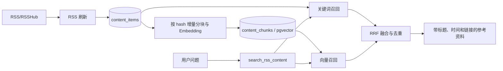

# RSS RAG 实现说明

第一阶段 RAG 以现有 RSS 缓存为知识源，实现内容分块、增量向量化、混合检索和带来源回答。订阅、投递状态等强一致业务数据仍由原有 SQL/Agent 工具负责，不从向量索引读取。

## 数据流



## 数据模型

`content_chunks` 与 `content_items` 是多对一关系，保存：

- 分块序号和文本；
- 包含内容 hash、分块规则版本和文本的分块 hash；
- Embedding 模型、维度和向量；
- 创建及更新时间。

PostgreSQL 使用 `pgvector` 的 `vector` 类型。模型维度不写死，查询时按模型名和实际维度过滤，允许更换 OpenAI-compatible Embedding 模型。SQLite 测试环境用 JSON 保存向量。

配置 `MOEGAL_EMBEDDING_MODEL` 后，项目启动的 `init_db()` 会执行 `CREATE EXTENSION IF NOT EXISTS vector` 并创建分块表。部署数据库用户需要具有启用扩展的权限，或者由管理员提前创建 `vector` 扩展。未配置 Embedding 时不会创建该表，也不会影响原有聊天、订阅、摘要和关键词检索功能。

## 增量索引

每次 RSS 刷新完成后，`services/rss_pipeline/content_index.py` 会：

1. 为标题、作者、标签和摘要生成检索文本；
2. 仅对长摘要按 1200 字符、120 字符重叠窗口切分；
3. 比较分块 hash 和 Embedding 模型，未变化内容不重复请求模型；
4. 批量生成向量；
5. 保存前再次检查 `content_items.hash`，避免并发刷新时写入旧向量。

Embedding 失败只记录日志，不会让 RSS 抓取和内容缓存失败。下一次刷新会再次尝试。

首次启用或切换 Embedding 模型后，可以为全部历史缓存补建索引：

```bash
uv run python -m scripts.index_rss_content
```

该命令可重复执行，只处理缺失、内容改变或模型不同的条目。

## 混合检索

`services/rss_pipeline/retrieval.py` 同时执行：

- 词面召回：适合作品名、角色名、组织名等专有词；
- pgvector 余弦距离召回：适合同义表达和自然语言问题；
- 时间过滤：工具默认只查询最近 30 天，可由 Agent 调整；
- RRF 融合：合并两路排名并按内容条目去重。

结果会携带来源编号、标题、UTC 发布时间、作者/来源、正文片段和原始链接。系统提示要求 Agent 使用检索事实时保留来源链接。

若没有配置 Embedding 模型，或者查询向量临时生成失败，检索会自动降级为词面召回。

## 配置

```env
# 必填：上游 OpenAI-compatible 服务提供的 Embedding 模型名
MOEGAL_EMBEDDING_MODEL=

# 可选：Embedding 使用不同供应商时单独配置；默认复用 OPENAI_API_KEY
MOEGAL_EMBEDDING_API_KEY=

# 可选：默认复用 MOEGAL_LLM_GATEWAY_BASE_URL / OPENAI_BASE_URL
MOEGAL_EMBEDDING_BASE_URL=

# 可选：指定输出向量维度；智谱 embedding-3 推荐通用场景使用 1024
MOEGAL_EMBEDDING_DIMENSIONS=

# 可选：默认 32，范围 1～256
MOEGAL_EMBEDDING_BATCH_SIZE=32

# 可选：语义结果最低余弦相似度，默认 0.25
MOEGAL_RAG_MIN_SIMILARITY=0.25
```

Embedding 请求默认复用 `OPENAI_API_KEY`。聊天与 Embedding 使用不同供应商时，同时配置 `MOEGAL_EMBEDDING_BASE_URL` 和 `MOEGAL_EMBEDDING_API_KEY`。

## 测试

```bash
uv run python -m unittest tests.test_rss_rag tests.test_agent_tools tests.test_rss_refresher -v
```

测试覆盖增量索引、内容更新后重建、语义召回、无 Embedding 时降级、时间过滤、来源格式和 Agent 工具注册。

## 检索评测

`evals/rss_rag_questions.json` 包含 30 条覆盖动画、游戏、AI、科技、开发和安全资讯的真实问题。缓存刷新并完成历史索引后运行：

```bash
uv run python -m scripts.evaluate_rss_rag
```

脚本输出每题 Top 5 标题、链接和召回方式，并汇总：

- `result_rate`：有检索结果的问题比例；
- `source_link_rate`：结果中包含原始链接的比例；
- `keyword_hit_rate`：带实体/主题标注问题的关键词命中比例；
- `embedding_enabled`：本次评测是否实际产生语义召回结果。

无固定实体的开放问题保留给人工判断结果相关性，不计入关键词命中率。换 Embedding 模型、调整相似度阈值或分块规则前后应保存两次输出并对比。
